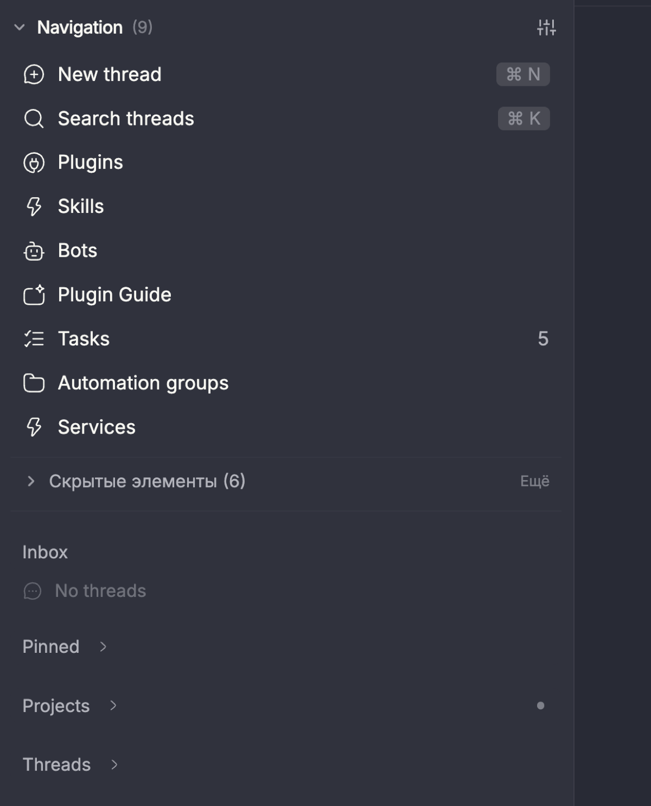
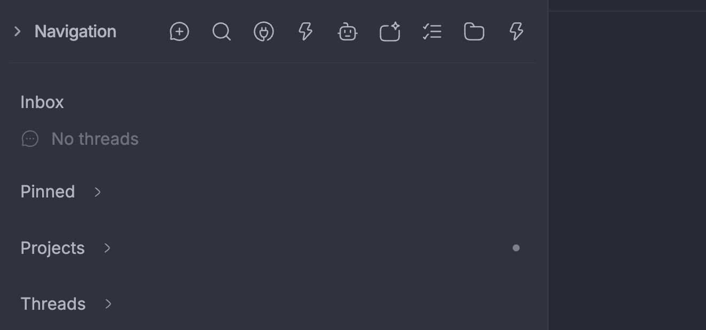

# Collapsible Navigation for BB

Reclaim sidebar space with an upward-folding collapsible navigation panel for BB.

## Features

- **Upward Collapsible Panel**: Smoothly collapse the navigation controls into a slim 28px header, giving maximum vertical screen space to your thread list.
- **Quick Actions in Collapsed State**: Access top visible actions with 1 click directly from the collapsed bar.
- **Native BB Navigation Integration**: Full support for split-view drag-and-drop, shortcut keys, accessories, and customizable ordering.
- **Hidden Items Drawer**: Non-destructive access to hidden navigation items with one-click restore.
- **Header Navigation Slot**: Optional slot to place navigation icons directly beside window controls in the top sidebar header.
- **Persistent State**: Remembers collapsed/expanded state across restarts in `localStorage`.

## Screenshots

### Expanded


### Collapsed


## Installation

Install via the BB Community Marketplace, or install directly using the BB CLI:

```bash
bb plugin install git:https://github.com/VanDalkvist/bb-plugin-collapsible-navigation.git
```

## How to Use

1. After installation, the plugin automatically activates `collapsible-navigation/collapsible` as your navigation provider.
2. You can also configure it manually in **Settings → Appearance → Navigation**, choosing **Collapsible Navigation**.
3. Click the **Navigation** header or the chevron icon in the sidebar to collapse upward or expand.
4. *(Optional)* In **Settings → Appearance → Header**, select **Header Navigation Icons** to place icons in the top bar.

## License

MIT © [VanDalkvist](https://github.com/VanDalkvist)
